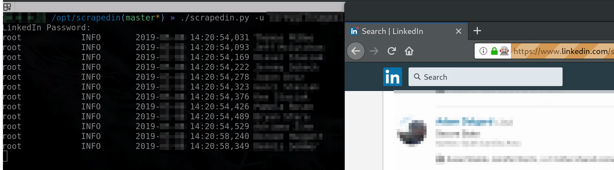

# ScrapedIn
Generate potential email addresses from LinkedIn

## Description
In 2017 scrapedin was created. The tool has been kept internal because there is a fear that linkedin will pursue legal action for publishing a scrapper. To overcome this fear, scrapedin is being published without any credit to the developers. It should be noted that this tool is to be used by professionals performing testing for organizations that they are authorized to work with. Malicious/illegal use of this tool is not the intention. Use at your own risk, as scrapedin does violate linkedins TOS. If this tool is useful to you- give thanks by spreading the word.

ScrapedIn allows you to gather the names of employees on LinkedIn and generate emails in the format of your choosing at runtime (`-s` allows users to specify format strings).  This is useful for penetration tests that include phishing. This scrapper relies on selenium and the gecko webdriver. When you run the scrapper, you will be able to watch the scrapping happening live in a web browser. The reason scrapedin was not made headless is because it makes debugging issues exceptionally easy.

A CSV file with the users name, email, title, location and profie URL is output after a scrape is completed. Scrapedin also provides users with a way to generate email addresses from a specific geopgrahical region, which can help you be more targeted during a red team engagement.




## Example Usage:
```
# Company Scraping
./scrapedin.py -c "Company Name" -o filename.csv -u email@domain.com -s {first:.1}{last}@{domain}.com

# Georegion Scraping - Useful for scraping users from a company within a specific region
./scrapedin.py -c "Giant Global Conglomorate" -o filename.csv -u email@domain.com -s
{first}.{last}@{domain}.com -g "New York City"

# Industry Scraping - Useful for multiple companies with same name but different industries
./scrapedin.py -c "Smith Inc." -o filename.csv -u email@domain.com -i manufacturing

# Georegion/Industry lookup syntax - View available/valid regions/industries to scrape for
./scrapedin.py -l -g "Somewhere" -i "manufacturing"
```

## Requirements:
* Selenium
* Firefox-ESR
* Gecko webdriver
* Python 3.3+


## Install Dependencies:
Selenium/Geckodriver:


	sudo python3 setup.py install

## Manually install dependencies:
Gecko Webdriver:

Find the current release of the Gecko Webdriver here (https://github.com/mozilla/geckodriver/releases).  Once you have the correct web address, follow these instructions:

	wget https://github.com/mozilla/geckodriver/releases/download/v0.14.0/geckodriver-YOUR-VERSION.tar.gz
	tar -xvzf geckodriver-YOUR-VERSION.tar.gz
	sudo cp geckodriver /usr/bin/geckodriver
	rm gecko*

Firefox (Debian/Kali):


	sudo apt-get install firefox-esr
